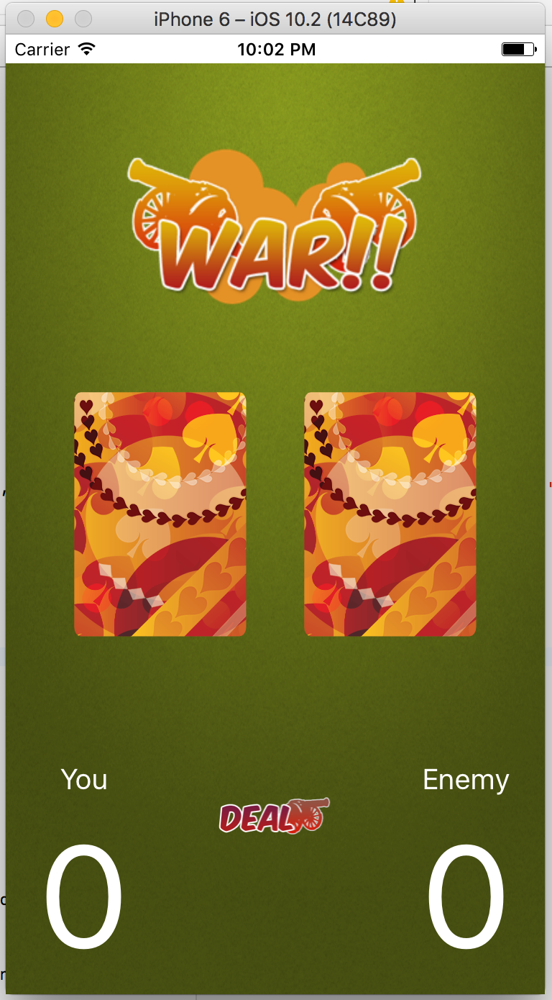
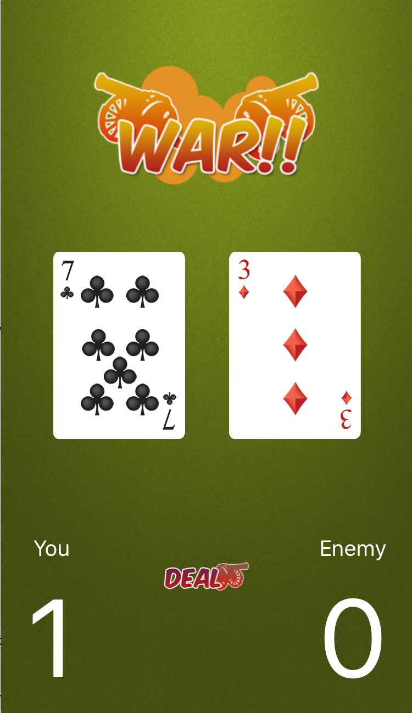

# War Game
## An Nguyen
This iOS game app is based on the classic War card game. I created this app to gain a better overall understanding of the iOS application development process and Swift.

## The Play
Each player turns up a card at the same time and the player with the higher card earns a point.
Player with highest points wins

## Skills learned:
- iOS development
- Basics of Swift
- Storyboard usage
- User design
- Teamwork
- Communication

## Screenshots:

###*Home Screen*:

###*Playing*:

